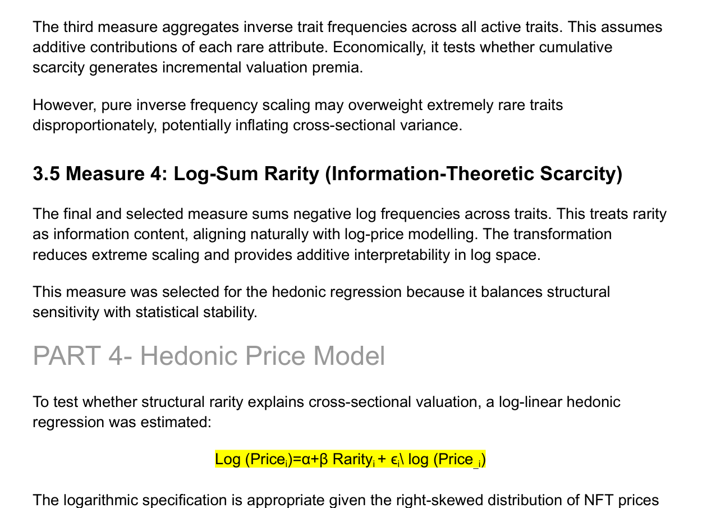
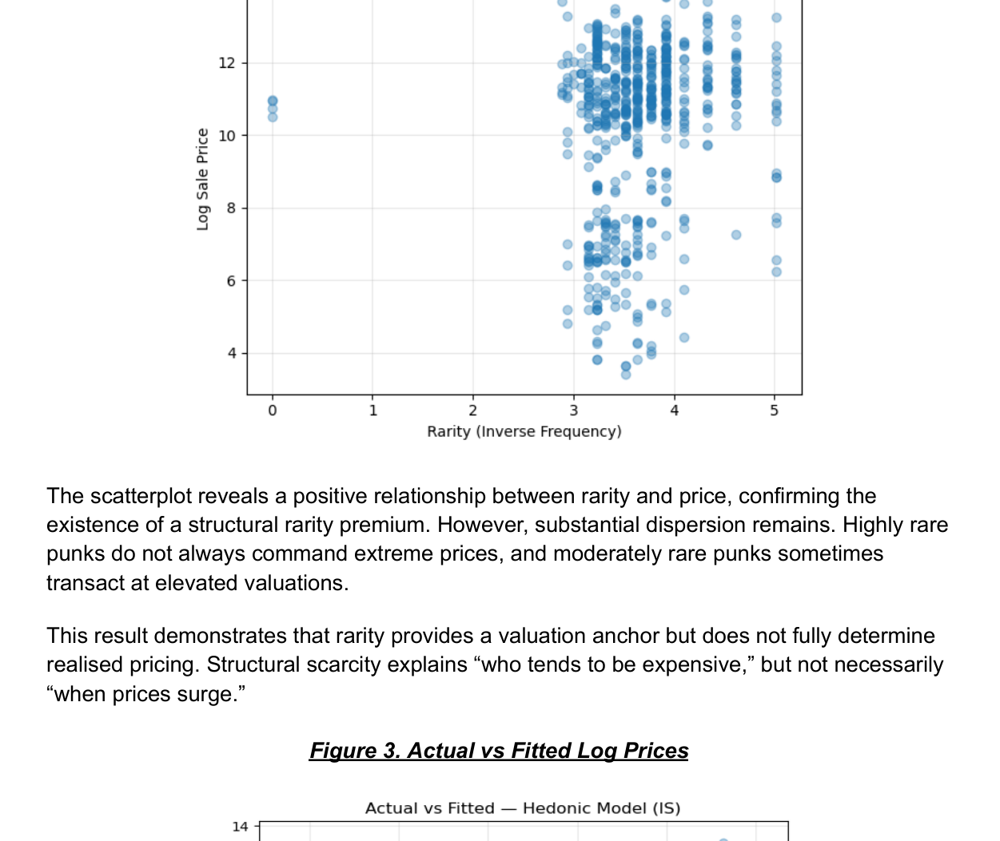
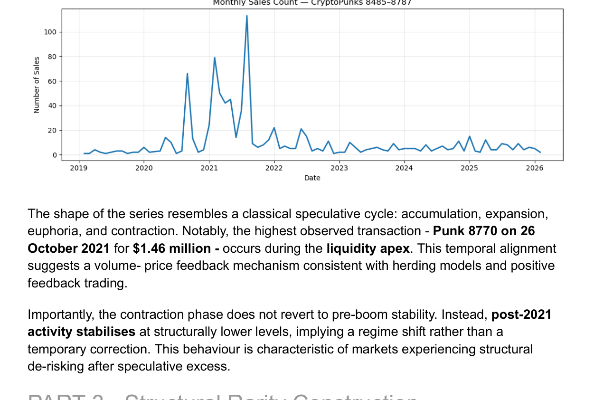
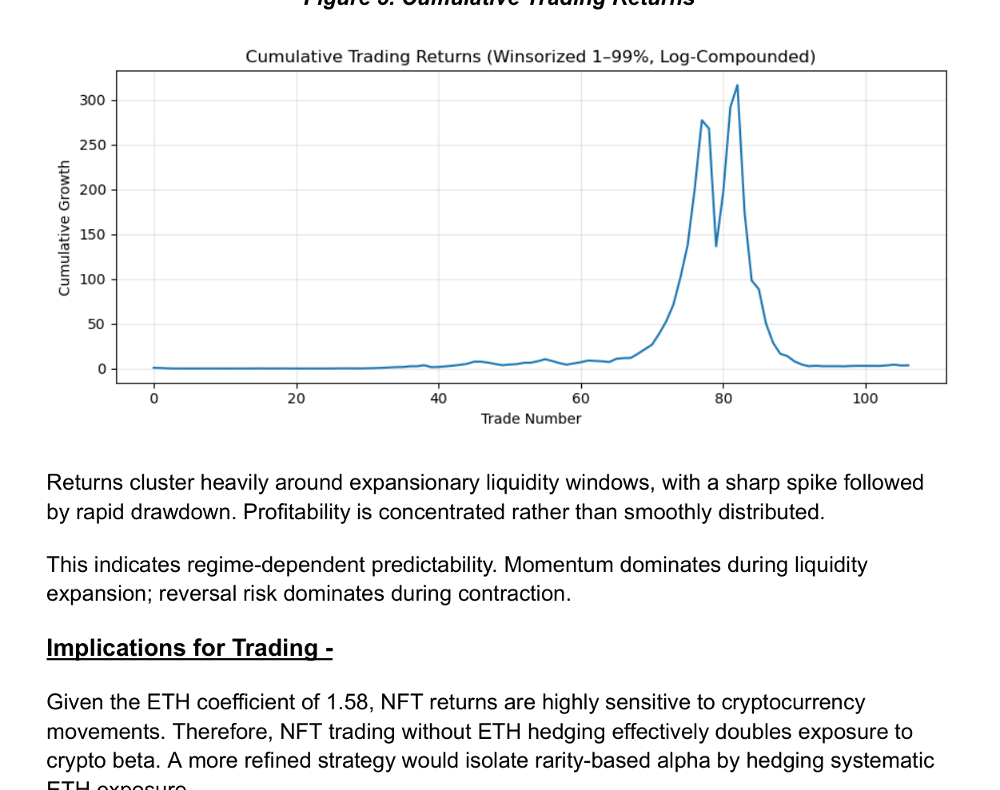

# CryptoPunks Market Analysis

**Can NFT prices be explained by rarity, liquidity, market regimes and the wider crypto market?**

This project analyses **11,587 CryptoPunks transactions across 303 assets**, combining NFT characteristics with market and behavioural signals to study the drivers of prices and trading activity.

## Analysis 

- Engineered **rarity scores** from CryptoPunk attributes
- Analysed price and liquidity behaviour across different **market regimes**
- Built a **hedonic pricing model** using asset and market characteristics
- Measured CryptoPunks' exposure to **Ethereum (ETH)**
- Used **repeat-sales analysis** to examine realised trading returns
- Investigated whether rarity translates into higher prices, stronger returns or simply lower liquidity

## Key Results

| Finding | Result |
|---|---:|
| Transactions analysed | **11,587** |
| CryptoPunks analysed | **303** |
| Hedonic model R² | **0.895** |
| ETH coefficient | **~1.58** |
| Repeat-sale trades | **107** |
| Average realised return | **~5.82%** |

The pricing model explained approximately **89.5% of observed price variation**, while the ETH coefficient suggests CryptoPunk prices were strongly exposed to movements in the broader crypto market.

One of the more interesting findings: **rarity mattered for valuation, but rare didn't automatically mean liquid or profitable.**

### Pricing Model

### Liquidity & Trading Regimes

## Technical Approach

`Python` · `Pandas` · `NumPy` · `Statsmodels` · `Regression` · `Feature Engineering` · `Time-Series Analysis` · `Data Visualisation` · `Trading Analytics`

The analysis covers the full workflow from **raw transaction data → feature engineering → statistical modelling → market interpretation**.

## Repository

- `notebooks/` — complete analysis and modelling workflow
- `data/` — project datasets/samples
- `results/` — key model and market visualisations

---

*Turns out even pixelated punks need proper risk analysis.*
